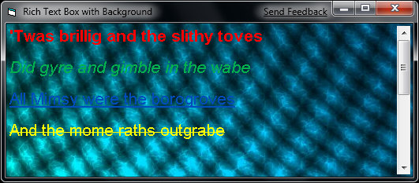

<div align="center">

## RTBackground


</div>

### Description

RTBacgkround demonstrates how to make a Rich Text Box have a transparent background, allowing a background image to be placed below it in order to give the appearance of a background image.
 
### More Info
 
File name of an image

The scroll bar does not redraw, though it will reappear if you hover over it with your mouse.


<span>             |<span>
---                |---
**Submitted On**   |2009-05-04 12:10:54
**By**             |[Andrew Sachen](https://github.com/Planet-Source-Code/PSCIndex/blob/master/ByAuthor/andrew-sachen.md)
**Level**          |Beginner
**User Rating**    |4.8 (19 globes from 4 users)
**Compatibility**  |VB 5\.0, VB 6\.0
**Category**       |[Graphics](https://github.com/Planet-Source-Code/PSCIndex/blob/master/ByCategory/graphics__1-46.md)
**World**          |[Visual Basic](https://github.com/Planet-Source-Code/PSCIndex/blob/master/ByWorld/visual-basic.md)
**Archive File**   |[RTBackgrou215145542009\.zip](https://github.com/Planet-Source-Code/andrew-sachen-rtbackground__1-72066/archive/master.zip)

### API Declarations

```
Private Declare Function SetWindowLongA Lib "user32" (ByVal hWnd As Long, ByVal nIndex As Long, ByVal dwNewLong As Long) As Long
```


